## 一、项目介绍

通过springboot整合jwt和security进行认证和授权，通过用户名/密码的方式进行用户的认证和授权。

认证通过jwt+JDBC的方式，授权这里使用了两种方式，分别是

- SpringSecurity自带的hasRole方法+SecurityConfig 

- 我们自定义的PermissionService+@PreAuthorize注解。

## 二、SpringSecurity简介

#### SpringSecurity中的几个重要组件：

#### 1.SecurityContextHolder（class）：用来存储和获取当前线程关联的 SecurityContext 对象的类。

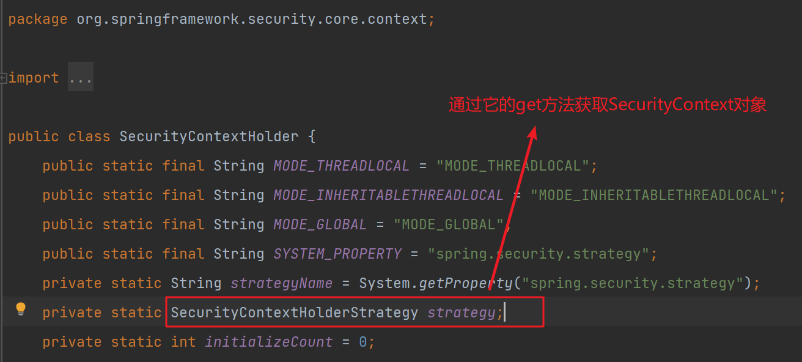

其中有两种 SecurityContext 模式：

- **MODE_THREADLOCAL**：将 SecurityContext 对象存储到当前线程中，只在当前线程中可见。多线程时，每个线程的 SecurityContext 对象都是独立的。
- **MODE_INHERITABLETHREADLOCAL**：将 SecurityContext 对象存储到当前线程中，对当前线程和子线程都可见。也就是说，在当前线程中存储的 SecurityContext 对象可以被传递给子线程使用。

**表示用户已通过身份验证的最简单方法就是设置 SecurityContextHolder！**

#### 2.SecurityContext（Interface）：用来存储当前已经被认证的用户，包含了当前执行操作的线程上下文信息以及用户认证和授权信息。包含Authentication。

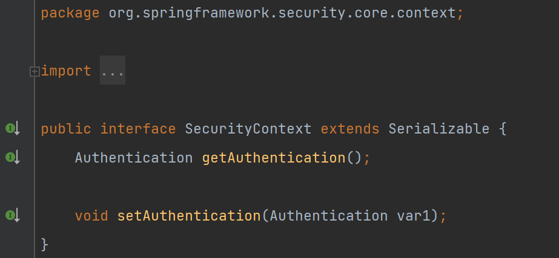

#### 3.Authentication（Interface）：存储了当前正在执行操作的用户的身份验证信息，包括用户名、密码、权限，可以作为AuthenticationManager的输入，它包含principal、credentials、authorities。

- principal：用户的标识。通常情况下是UserDetails接口的一个实例。
- credentials：用户的密码。多数情况下，为确保密码不被泄露，会在用户身份验证之后被清除。
- authorities：用户拥有的权限。

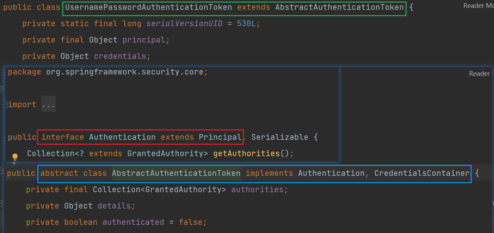

Authentication 接口的常用实现类有以下几种：

- AnonymousAuthenticationToken：匿名用户的身份验证信息。
- UsernamePasswordAuthenticationToken：用户名/密码的身份验证信息。
- RememberMeAuthenticationToken：用于“记住我”功能的身份验证信息。
- PreAuthenticatedAuthenticationToken：基于预先认证信息的身份验证。

通常情况下，用户在进行登录时需要通过身份验证，当身份验证成功时，就会通过 Authentication 接口封装用户的身份信息。在后续的操作中，认证后的用户可以通过 SecurityContextHolder 获取 Authentication 对象，并根据其中的信息获得用户的身份信息及相应的权限等。

**对比SecurityContext和Authentication**：

Authentication 是一个封装了用户身份认证信息的对象，表示用户已经通过了验证。

SecurityContext 则是一个上下文类对象，用于保存和获取当前线程关联的上下文信息，包括了 Authentication 对象。

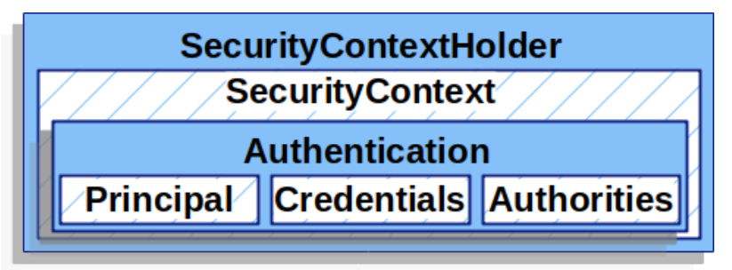

#### 4.AuthenticationManager（Interface）：定义了用户身份验证的api接口（例如将用户名和密码和数据库进行比对）。可以接收一个Authentication对象作为入参，验证成功后会返回已被验证的Authentication对象。

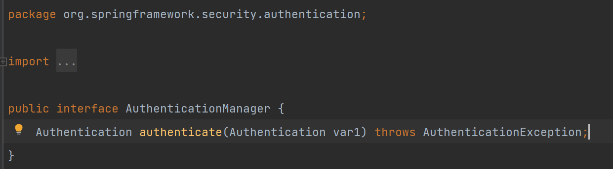

#### 5.GrantedAuthority（Interface）：授权信息以GrantedAuthority的形式存储在Authentication对象中，GrantedAuthority接口表示一个授权（权限）对象，包含一个字符串类型的授权名字（authority name）。授权名字通常是一个表示权限的字符串，例如"ROLE_ADMIN"、"ROLE_USER"等


## 二、整理思路

1. 搭建springboot项目，导入相关依赖
2. 在数据库导入sql创建用户表
3. 创建几个关于User的对象便于数据传输
4. dao层开发（对用户信息增删改查）
5. 实现UserDetails接口和UserDetailService接口
6. 自定义实现校验token的拦截器JwtAuthenticationTokenFilter
7. 自定义实现用户登录校验的拦截器JWTAuthenticationFilter
8. service层开发（包括PermissionService和UserService）
9. 创建测试Controller
10. 实现SpringSecurity的配置类SecurityConfig
11. 通过postman进行测试


## 三、具体实现步骤

#### 1.项目主要相关依赖如下：

```xml
<dependencies>
  <dependency>
    <groupId>org.springframework.boot</groupId>
    <artifactId>spring-boot-starter-web</artifactId>
    <version>2.3.12.RELEASE</version>
  </dependency>
  <dependency>
    <groupId>org.springframework.boot</groupId>
    <artifactId>spring-boot-starter-security</artifactId>
    <version>2.3.12.RELEASE</version>
  </dependency>
  <dependency>
    <groupId>mysql</groupId>
    <artifactId>mysql-connector-java</artifactId>
    <version>8.0.28</version>
  </dependency>
  <dependency>
    <groupId>io.jsonwebtoken</groupId>
    <artifactId>jjwt</artifactId>
    <version>0.9.0</version>
  </dependency>
  <dependency>
    <groupId>org.mybatis.spring.boot</groupId>
    <artifactId>mybatis-spring-boot-starter</artifactId>
    <version>1.3.0</version>
  </dependency>
</dependencies>
```

#### 2.用户表

创建一个名为security_jwt_demo的数据库，导入项目根目录下/db/db.sql文件即可。

#### 3.项目中用到的几个user相关对象

（1）User实体

对应数据库中的user表

```java
@Data
public class User {

    private Long id;
    private String username;
    private String password;
    private String permission;
    private String role;

    @Override
    public String toString() {
        return "User{" +
        "id=" + id +
        ", username='" + username + '\'' +
        ", password='" + password + '\'' +
        ", permission='" + permission + '\'' +
        ", role='" + role + '\'' +
        '}';
    }
}
```

（2）LoginUser

UserDetails的实现类，使用用户名/密码验证时需要用到其作为返回值。这个类中包含了用户名、密码和当前登录用户所具备的权限。

```java
@Data
public class LoginUser implements UserDetails {

    private Long id;
    private String username;
    private String password;
    //通过自定义方式进行授权
    private Set<String> permissions = new HashSet<String>();

    //通过springSecurity进行授权
    private Collection<? extends GrantedAuthority> authorities;

    public LoginUser(){}

    public LoginUser(User user,Collection<? extends GrantedAuthority> authorities) {
        id = user.getId();
        username = user.getUsername();
        password = user.getPassword();
        permissions.add(user.getPermission());
        this.authorities = authorities;

    }

    @Override
    public Collection<? extends GrantedAuthority> getAuthorities() {
        return authorities;
    }

    @Override
    public String getPassword() {
        return password;
    }

    @Override
    public String getUsername() {
        return username;
    }

    @Override
    public boolean isAccountNonExpired() {
        return true;
    }

    @Override
    public boolean isAccountNonLocked() {
        return true;
    }

    @Override
    public boolean isCredentialsNonExpired() {
        return true;
    }

    @Override
    public boolean isEnabled() {
        return true;
    }
}
```

（3）UserVo

主要用来登录时从输入流中获取登录用户的信息，对应了前端传递的参数，包括用户名、密码、记住我等属性。

```java
@Data
public class UserVO {
    private String username;
    private String password;
    private Integer rememberMe;
}
```

#### 4.dao层开发

创建mapper接口并配置对应的mapper.xml

```java
@Mapper
public interface UserMapper {

    //根据用户名获取用户
    User getByName(String username);

    //根据用户id获取用户权限
    List<String> getPermissionById(Long id);

    //新增一个用户
    int insertUser(User user);
}
```

#### 5.实现UserDetail接口和UserDetailService接口

首先说一下为什么要实现这两个接口。

SpringSecurity提供了多种身份验证的方式，在这里我们使用的是用户名/密码的方式进行验证，而如果要使用这种方式进行验证的话，我们需要实现**UserDetailService**接口中的loadUserByUsername方法，这个方法用来从数据库中进行查询用户，然后和传入的用户密码进行比对。这个方法会返回一个UserDetails对象。

```java
@Service
public class UserDetailServiceImpl implements UserDetailsService {

    @Autowired
    UserMapper userMapper;

    @Override
    public UserDetails loadUserByUsername(String username) throws UsernameNotFoundException {
        User user = userMapper.getByName(username);
        List<SimpleGrantedAuthority> authorities = new ArrayList<>();
        return new LoginUser(user,authorities);
    }
}
```

对于UserDetailService接口，SpringSecurity提供了基于内存和JDBC的两种验证方式，默认是JDBC的方式。我们也可以通过自定义实现UserDetailService接口，来达到自定义身份验证的结果。这里我们使用的是自定义身份验证的方式。

对于UserDetails，在Spring Security中，UserDetails接口是表示用户信息的规范。该接口表示应用程序中的用户，并提供有关用户的基本信息，如用户名、密码、角色、权限等，因此我们需要有一个类似用户的对象来实现该接口（LoginUser）。

#### 6.JwtAuthenticationTokenFilter

检验用户token的过滤器。对于客户端发出的请求，首先对用户的token进行校验，如果token不合法表示当前用户未登录，继续执行其他过滤器的逻辑；如果token合法则设置SecurityContextHolder表示用户已被认证。

```java
/**
 * token过滤器 验证token有效性
 */
@Component
public class JwtAuthenticationTokenFilter extends OncePerRequestFilter {

    @Autowired
    UserMapper userMapper;

    @Override
    protected void doFilterInternal(HttpServletRequest request, HttpServletResponse response, FilterChain chain) throws ServletException, IOException {
        String token = request.getHeader(JwtTokenUtil.TOKEN_HEADER);
        if (StringUtils.isBlank(token) || !token.startsWith(JwtTokenUtil.TOKEN_PREFIX)){
            chain.doFilter(request,response);
            return;
        }
        try {
            //如果能获取到token则Authentication进行设置，表示已认证
            SecurityContextHolder.getContext().setAuthentication(getAuthentication(token));
        } catch (Exception e) {
            e.printStackTrace();
        }
        //继续执行其他过滤器的逻辑
        chain.doFilter(request,response);
    }

    private UsernamePasswordAuthenticationToken getAuthentication(String tokenHeader) throws Exception {
        String token = tokenHeader.replace(JwtTokenUtil.TOKEN_PREFIX,"");
        //判断token是否过期
        boolean expiration = JwtTokenUtil.isExpiration(token);
        if (expiration){
            throw new Exception("过期了");
        }else{
            String username = JwtTokenUtil.getUsername(token);
            User user = userMapper.getByName(username);
            List<String> permissions = userMapper.getPermissionById(user.getId());
            LoginUser loginUser = new LoginUser(user, Collections.singleton(new SimpleGrantedAuthority(user.getRole())));
            loginUser.setPermissions(new HashSet<>(permissions));
            //新建一个UsernamePasswordAuthenticationToken用来设置Authentication
            UsernamePasswordAuthenticationToken authenticationToken = new UsernamePasswordAuthenticationToken(loginUser, null, loginUser.getAuthorities());
            return authenticationToken;
        }
    }
}
```

#### 7.JWTAuthenticationFilter

用户登录时对用户名密码进行校验的过滤器，在token校验过滤器之后执行。在该过滤器中会对用户名密码进行比对，校验成功后返回一个token给客户端，下次客户端访问时在请求头带上此token代表该用户已经被认证。

```java
public class JWTAuthenticationFilter extends UsernamePasswordAuthenticationFilter {

    private ThreadLocal<Integer> rememberMe = new ThreadLocal<>();
    private AuthenticationManager authenticationManager;

    public JWTAuthenticationFilter(AuthenticationManager authenticationManager) {
        this.authenticationManager = authenticationManager;
        super.setFilterProcessesUrl("/auth/login");
    }

    @Override
    public Authentication attemptAuthentication(HttpServletRequest request,
                                                HttpServletResponse response) throws AuthenticationException {

        // 从输入流中获取到登录的信息
        try {
            UserVO vo = new ObjectMapper().readValue(request.getInputStream(), UserVO.class);
            rememberMe.set(vo.getRememberMe() == null ? 0 : vo.getRememberMe());
            return authenticationManager.authenticate(
                    new UsernamePasswordAuthenticationToken(vo.getUsername(), vo.getPassword(), new ArrayList<>())
            );
        } catch (IOException e) {
            e.printStackTrace();
            return null;
        }
    }

    // 成功验证后调用的方法
    // 如果验证成功，就生成token并返回
    @Override
    protected void successfulAuthentication(HttpServletRequest request,
                                            HttpServletResponse response,
                                            FilterChain chain,
                                            Authentication authResult) throws IOException, ServletException {

        LoginUser loginUser = (LoginUser) authResult.getPrincipal();
        System.out.println("loginUser:" + loginUser.toString());
        boolean isRemember = rememberMe.get() == 1;

        String role = "";
        String token = JwtTokenUtil.createToken(loginUser.getUsername(), role, isRemember);
        /* 返回创建成功的token
         但是这里创建的token只是单纯的token
         按照jwt的规定，最后请求的时候应该是 `Bearer token`*/
        response.setHeader("token", JwtTokenUtil.TOKEN_PREFIX + token);
    }

    @Override
    protected void unsuccessfulAuthentication(HttpServletRequest request, HttpServletResponse response, AuthenticationException failed) throws IOException, ServletException {
        response.getWriter().write("authentication failed, reason: " + failed.getMessage());
    }
}
```

#### 8.service层开发

由于业务逻辑比较简单，我们在service层中主要实现自定义授权的逻辑，用户相关的Service不做实现。

自定义授权的实现如下，首先在数据库的user表中有个string类型的permission字段，代表用户所拥有的权限。在进行授权时检查用户权限属性是否包含该权限，如果包含则表示当前用户具有访问权限。

```java
/**
 * 自定义权限实现，ss取自SpringSecurity首字母
 */
@Service("ss")
public class PermissionService {
    public boolean hasPer(String permission) throws Exception {
        if (StringUtils.isBlank(permission)){
            return false;
        }
        LoginUser loginUser = SecurityUtil.getLoginUser();
        if (loginUser == null || CollectionUtils.isEmpty(loginUser.getPermissions())) {
            return false;
        }
        return loginUser.getPermissions().contains(StringUtils.trim(permission));
    }
}
```

#### 9.Controller层开发

我们用到的Controller主要有两个，一个是用户相关的，一个是进行测试的接口。

对于我们进行授权测试的接口，在使用自定义授权逻辑时（PermissionService），要配合@PreAuthorize注解实现（createJob方法），对应的JobController如下：

```java
@RestController
@RequestMapping("/jobs")
public class JobController {

    @GetMapping("/list")
    public String listJobs(){
        System.out.println("接收到请求...");
        return "展示所有任务";
    }

    //通过PermissionService自定义授权实现
    @PostMapping("/create")
    @PreAuthorize("@ss.hasPer('job:add')")
    public String createJob(){
        return "创建一个新任务";
    }

    //通过SpringSecurity配合用户角色(role字段)实现权限管理
    @DeleteMapping("/delete")
    public String deleteJob(){
        return "删除一个任务";
    }
}
```

对于用户相关的Controller，我们只需要写一个注册方法就行了，如下所示：

```java
@RestController
@RequestMapping("/")
public class UserController {

    @Autowired
    UserMapper userMapper;

    @Autowired
    private BCryptPasswordEncoder bCryptPasswordEncoder;

    @PostMapping("/register")
    public String register(@RequestBody Map<String,String> registerUser){
        User user = new User();
        user.setUsername(registerUser.get("username"));
        //对密码进行一下加密
        user.setPassword(bCryptPasswordEncoder.encode(registerUser.get("password")));
        user.setPermission(registerUser.get("permission"));
        user.setRole(registerUser.get("role"));
        userMapper.insertUser(user);
        return user.toString();
    }
}
```

为什么不需要注册接口呢？是因为UsernamePasswordAuthenticationFilter已经帮我们实现了，默认是"/login"

```java
 public UsernamePasswordAuthenticationFilter() {
        super(new AntPathRequestMatcher("/login", "POST"));
 }
```

这里我们也可以对这个路径进行修改，如下所示：

```java
public JWTAuthenticationFilter(AuthenticationManager authenticationManager) {
        this.authenticationManager = authenticationManager;
        super.setFilterProcessesUrl("/auth/login");
    }
```

#### 10.通过SecurityConfig类对SpringSecurity进行配置

```java
@EnableWebSecurity
@EnableGlobalMethodSecurity(prePostEnabled = true, securedEnabled = true)
public class SecurityConfig extends WebSecurityConfigurerAdapter {

    @Autowired
    JwtAuthenticationTokenFilter jwtAuthenticationTokenFilter;

    @Autowired
    @Qualifier("userDetailServiceImpl")
    UserDetailsService userDetailsService;

    @Override
    protected void configure(AuthenticationManagerBuilder auth) throws Exception {
        auth.userDetailsService(userDetailsService).passwordEncoder(bCryptPasswordEncoder());
    }

    @Override
    protected void configure(HttpSecurity http) throws Exception {
        http.cors().and().csrf().disable()
                .authorizeRequests()
                // 测试用资源，需要验证了的用户才能访问
                .antMatchers("/jobs/create").authenticated()
                //只有角色为admin的用户才能进行删除
                .antMatchers(HttpMethod.DELETE,"/jobs/delete").hasRole("ADMIN")
                // 其他请求都放行了
                .anyRequest().permitAll()
                .and()
                .addFilter(new JWTAuthenticationFilter(authenticationManager()))
                // 不需要session
                .sessionManagement().sessionCreationPolicy(SessionCreationPolicy.STATELESS);
        //将验证token的过滤器添加在验证用户名/密码的过滤器之前
        http.addFilterBefore(jwtAuthenticationTokenFilter, UsernamePasswordAuthenticationFilter.class);
    }

    @Bean
    public BCryptPasswordEncoder bCryptPasswordEncoder(){
        return new BCryptPasswordEncoder();
    }

    @Bean
    CorsConfigurationSource corsConfigurationSource(){
        final UrlBasedCorsConfigurationSource source = new UrlBasedCorsConfigurationSource();
        source.registerCorsConfiguration("/**",new CorsConfiguration().applyPermitDefaultValues());
        return source;
    }
}
```

到这里就全部完成了！让我们测试一下是否生效。

#### 11.postman测试

这是数据库表中原有的角色和权限：

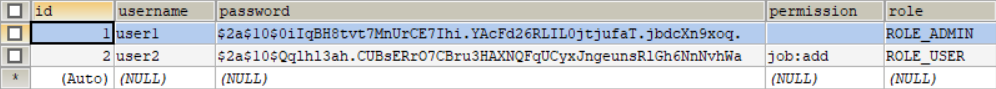

（1）测试注册接口

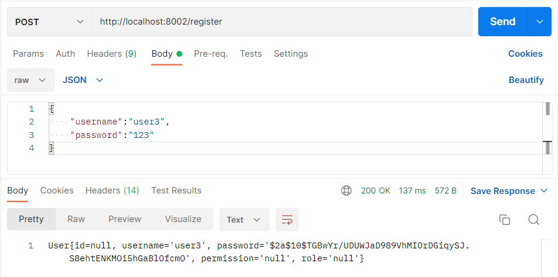

可以看到是可以注册成功的，但是我们这里使用原有user1和user2进行权限测试（偷个懒）

（2）测试登录接口

由于我们之前将原有的登录接口从"/login"改为了"/auth/login"，这里需要注意一下。

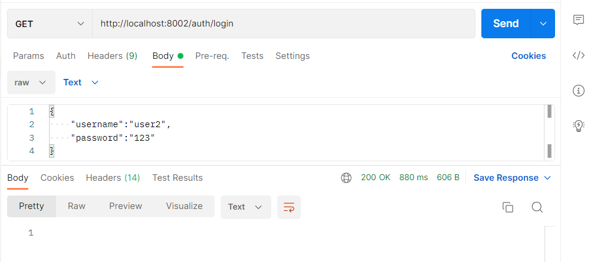

登录成功后的ResponseBody是空的，响应头中有token代表已经登录成功了。我们需要从header中获取该token，后续请求需要用到。这里展示了user2，user1也是一样的。

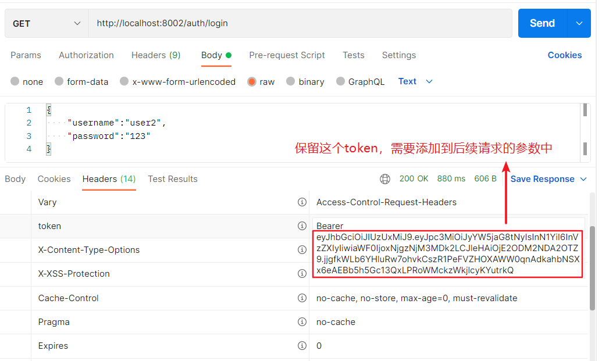

（2）测试创建任务接口

由于创建任务需要"job:add"权限，查看数据库user2是有该权限的，user1没有。

将刚才登录获得的token添加到参数中：

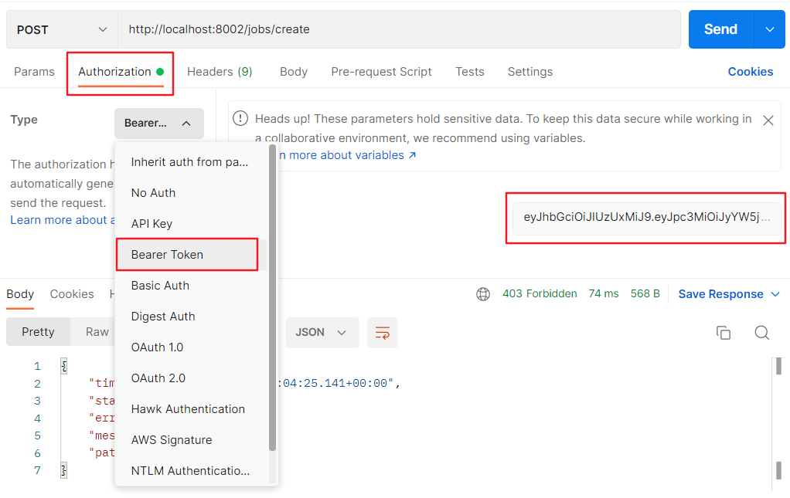

然后发现就可以创建成功了

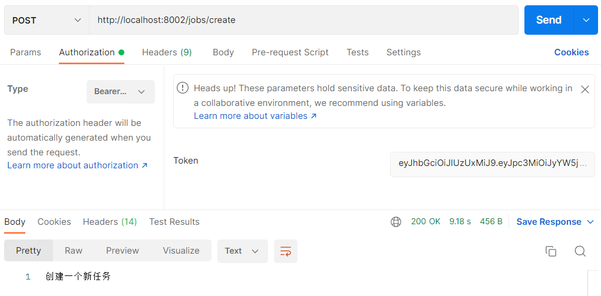

（3）测试删除任务接口

删除任务需要用户角色是admin，故user2是无法进行删除的。


（4）我们按照刚才的流程对user1进行测试，来达到对比的效果。

登录：

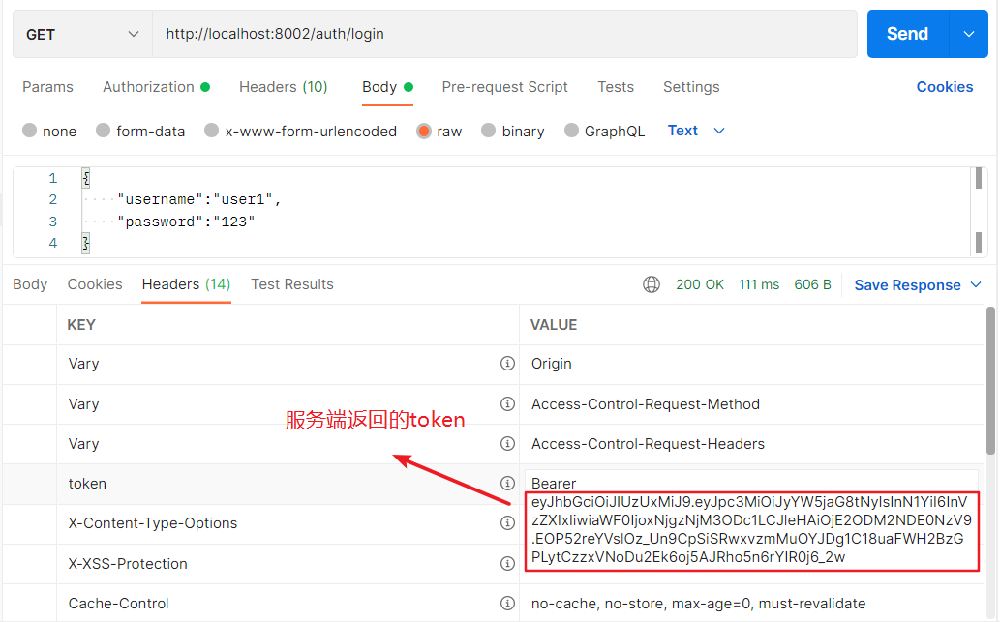

创建任务：

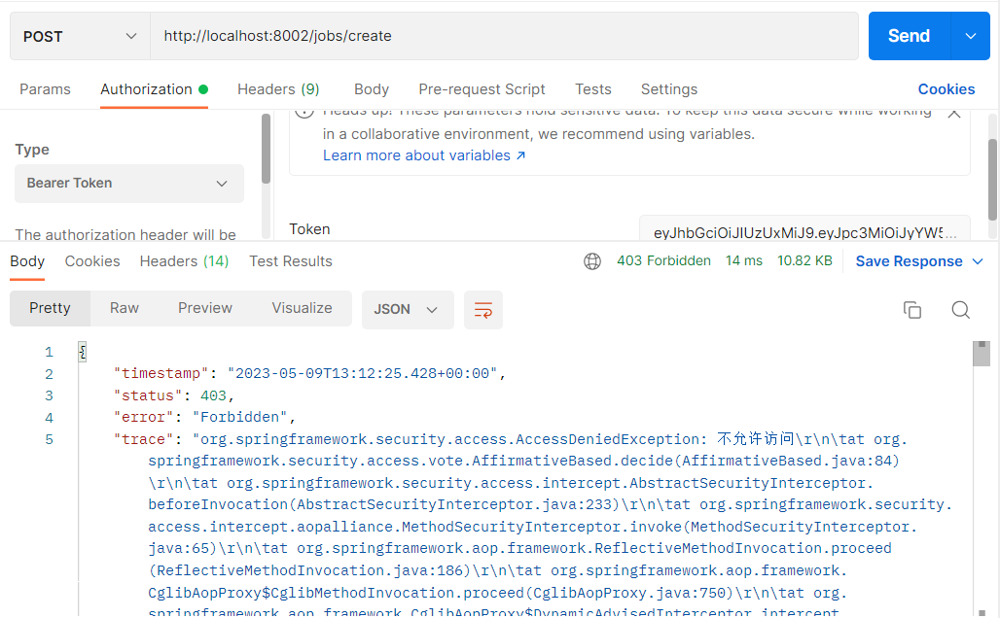

删除任务：

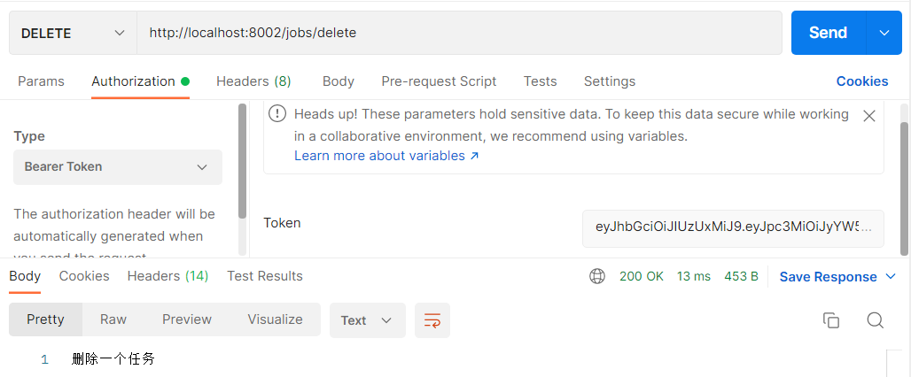

对于查询接口不需要进行认证和授权，也就是说不需要登录就能访问：

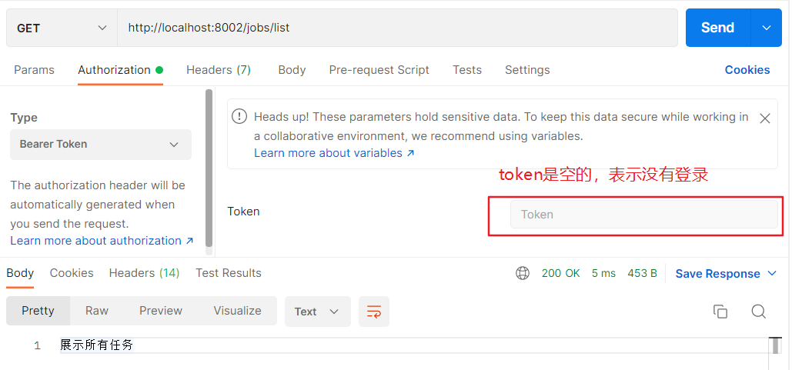